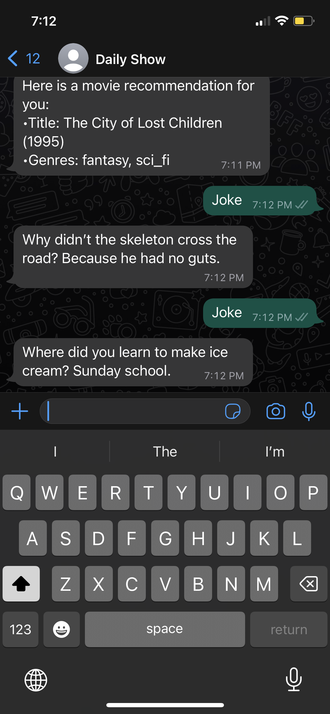

# daily-show

The Daily Show is a Whatsapp powered bot that caters to everyday utils such as covid statistics, weather, news, movie recommendations, stock prices, etc. It is built using Meta's Whatsapp API and Python's Flask framework. It is currently deployed on Heroku with a move to AWS Lambda in the works. To gather the data, the bot uses a variety of APIs such as OpenWeather, IMDb, NewsAPI, and AlphaVantage.

### Here are some of the features displayed through screenshots:

#### List of commands

#### Weather

#### News

#### Movie recommendations

#### Jokes

